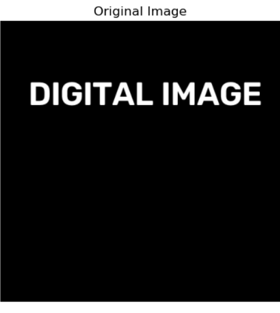
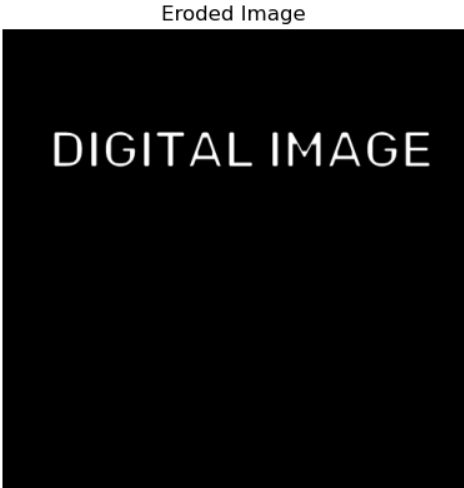
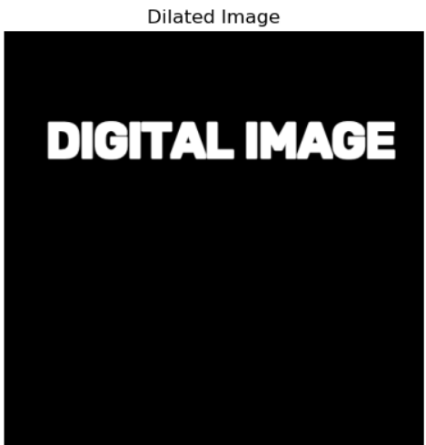

# Implementation of Erosion and Dilation Using OpenCV

## Aim

To write a Python program using OpenCV to perform morphological operations such as Erosion and Dilation on an image.

The program performs the following operations:

- Image Erosion
- Image Dilation

## Software Used

- Anaconda – Python 3.7
- Jupyter Notebook / VS Code
- OpenCV (cv2)
- NumPy
- Matplotlib

## Algorithm

### Step 1:

Import the required libraries: OpenCV, NumPy, and Matplotlib.

### Step 2:

Create a blank image using NumPy.

### Step 3:

Insert text onto the image using OpenCV's text drawing function.

### Step 4:

Display the original image.

### Step 5:

Create a structuring element (kernel) of suitable size.

### Step 6: Image Erosion

- Apply the erosion operation using the created kernel.
- Remove pixels from the boundaries of foreground objects.
- Display the eroded image.

### Step 7: Image Dilation

- Apply the dilation operation using the same kernel.
- Add pixels to the boundaries of foreground objects.
- Display the dilated image.

### Step 8:

Compare the original, eroded, and dilated images.

## Program
Import the necessary packages:

```
import cv2
import numpy as np
import matplotlib.pyplot as plt
image = np.zeros((500, 500, 3), dtype="uint8")
```

Create the Text using cv2.putText:

```
text = "DIGITAL IMAGE"
font = cv2.FONT_HERSHEY_SIMPLEX
cv2.putText(image, text, (50, 150), font, 2, (255, 255, 255), 3)
```

Create the structuring element:

```
kernel = cv2.getStructuringElement(cv2.MORPH_RECT, (5, 5))
```

Original image:

```
image_rgb = cv2.cvtColor(image, cv2.COLOR_BGR2RGB)
plt.imshow(image_rgb)
plt.title("Original Image")
plt.axis("off")
```

Erode the image:

```
eroded_image = cv2.erode(image, kernel, iterations=1)
eroded_image_rgb = cv2.cvtColor(eroded_image, cv2.COLOR_BGR2RGB)
plt.imshow(eroded_image_rgb)
plt.title("Eroded Image")
plt.axis("off")
```

Dilate the image:

```
dilated_image = cv2.dilate(image, kernel, iterations=1)
dilated_image_rgb = cv2.cvtColor(dilated_image, cv2.COLOR_BGR2RGB)
plt.imshow(dilated_image_rgb)
plt.title("Dilated Image")
plt.axis("off")
```

## Developed By

**Name:** Udhaya Nandhini M

**Register No:** 212225240177

## Output

### Original Image

- A text image containing characters is displayed.
- The image serves as the input for morphological processing.


### Erosion

- Original image is displayed.
- Eroded image is displayed.
- The thickness of the characters is reduced.
- Object boundaries shrink inward.


### Dilation

- Original image is displayed.
- Dilated image is displayed.
- The thickness of the characters increases.
- Object boundaries expand outward.


## Result

Thus, the morphological operations **Erosion** and **Dilation** are successfully implemented using OpenCV.
